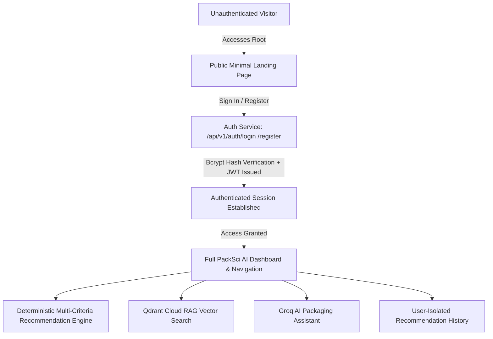

# PackSci AI — AI-Based Intelligent Food Packaging Material Recommendation System

An industrial-grade, full-stack decision-support system and candidate screening engine for food packaging engineering. The system couples deterministic multi-criteria decision analysis (MCDA), biological produce respiration kinetics (Q10/EMAP), ASTM polymer barrier modeling, Qdrant Cloud vector search, and Groq LLM intelligence with a secure, authentication-first portal.

---

## Architecture & Authentication Overview

PackSci AI follows a secure **Authentication-First Portal Architecture**:
- **Public Surface**: Unauthenticated visitors see only the project branding, introduction, and Sign In / Register buttons. All internal dashboards, recommendation wizards, AI assistant tools, material databases, and recommendation histories are protected behind strict authentication guards.
- **Backend Security**: Protected endpoints (`/api/v1/recommendations`, `/api/v1/ai/chat`, `/api/v1/ai/explain`, `/api/v1/qdrant/ingest`) require verified Bearer JWT tokens.
- **Data Isolation**: User recommendation histories are strictly scoped to the authenticated user's account with database-enforced foreign keys.



### Technology Stack
- **Frontend**: React 19, TypeScript, Vite, Tailwind CSS, Lucide Icons, Recharts
- **Backend**: Python 3.13, FastAPI, Pydantic v2, SQLAlchemy 2.x, PyJWT, Passlib (Bcrypt)
- **Database**: Supabase PostgreSQL / Local PostgreSQL with Alembic/SQLAlchemy models
- **Vector Database**: Qdrant Cloud (`packaging_knowledge_base`, FastEmbed BAAI/bge-small-en-v1.5 384-dim embeddings)
- **AI Service**: Groq API (`qwen/qwen3.8-27b` / `llama-3.3-70b-versatile`) for RAG chat and polymer trade-off synthesis
- **Testing**: Pytest, FastAPI TestClient, HTTPX

---

## Key Features

1. **Authentication-First Portal**:
   - Clean, professional public landing page (white/slate surfaces with emerald green accents).
   - Dedicated Login and Registration pages with client-side & server-side validation, password strength meter, show/hide password toggle, and error messaging.
   - Centralized route guard preventing unauthenticated access to internal pages.
   - User profile dropdown with session management and secure logout.

2. **User-Isolated Recommendation History**:
   - Each recommendation evaluation is bound to the creating user.
   - Users cannot access, view, or delete other users' private recommendations.

3. **Deterministic Scientific Recommendation Engine**:
   - Barrier evaluation against product moisture and lipid oxidation thresholds ($OTR$, $WVTR$).
   - Fresh produce equilibrium modified atmosphere packaging (EMAP) gas flux matching.
   - Elimination of hazardous materials (e.g., anaerobic fermentation risks in respiring produce, low-temperature embrittlement at $<0^\circ\text{C}$).
   - Transparent subscore breakdown: Moisture, Oxygen, Thermal, Mechanical, Cost, and Circularity.

4. **Groq AI Assistant & Qdrant RAG**:
   - Grounded RAG packaging assistant powered by Qdrant vector retrieval.
   - Real-time source citations and relevance scoring.
   - Polymer science trade-off explanations.

---

## Quick Start & Setup Guide

### 1. Backend Setup

```powershell
# Navigate to backend directory
cd backend

# Create virtual environment
python -m venv venv

# Activate virtual environment
.\venv\Scripts\Activate.ps1

# Install dependencies
pip install -r requirements.txt

# Start FastAPI server
uvicorn app.main:app --reload --host 127.0.0.1 --port 8000
```

FastAPI OpenAPI interactive docs: `http://127.0.0.1:8000/docs`

---

### 2. Frontend Setup

In a new terminal:
```bash
cd frontend

# Install dependencies
npm install

# Start Vite dev server
npm run dev
```

Open your browser at: `http://localhost:5173`

---

### 3. Running Automated Tests

```powershell
# In backend/ directory with venv activated:
.\venv\Scripts\python.exe -m pytest tests/test_auth_and_rag.py -v
```

All authentication, user isolation, RAG, and Qdrant integration tests will execute and validate.

---

## REST API Specification

### Authentication Endpoints (Public)
| Method | Endpoint | Description |
| :--- | :--- | :--- |
| `POST` | `/api/v1/auth/register` | Register a new user account with bcrypt salted hash |
| `POST` | `/api/v1/auth/login` | Authenticate user and receive JWT access token |
| `GET` | `/api/v1/auth/me` | Retrieve current authenticated user profile |
| `POST` | `/api/v1/auth/logout` | Invalidate current session |

### Protected Application Endpoints (Requires Bearer Token)
| Method | Endpoint | Description |
| :--- | :--- | :--- |
| `POST` | `/api/v1/recommendations` | Run recommendation engine and save under user account |
| `GET` | `/api/v1/recommendations` | List user-isolated recommendation history |
| `GET` | `/api/v1/recommendations/{id}`| Retrieve a saved recommendation |
| `DELETE` | `/api/v1/recommendations/{id}`| Delete a saved recommendation |
| `POST` | `/api/v1/ai/chat` | RAG query with Qdrant vector retrieval and Groq LLM |
| `POST` | `/api/v1/ai/explain` | Generate AI technical explanation for a recommendation |
| `POST` | `/api/v1/qdrant/ingest` | Ingest knowledge documents into Qdrant collection |

### Public Reference Endpoints
| Method | Endpoint | Description |
| :--- | :--- | :--- |
| `GET` | `/api/v1/health` | System health check (PostgreSQL, Groq, Qdrant status) |
| `GET` | `/api/v1/commodities` | List food commodities catalog |
| `GET` | `/api/v1/commodities/{id}` | Get detailed commodity specifications |
| `GET` | `/api/v1/materials` | List packaging materials catalog |
| `GET` | `/api/v1/materials/{id}` | Get material specifications |
